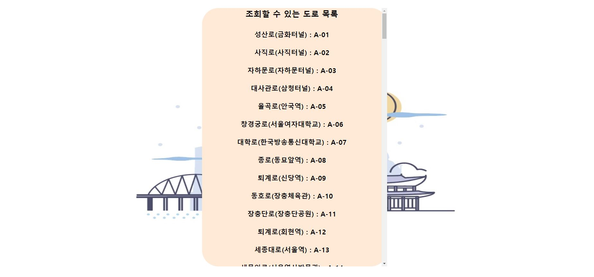
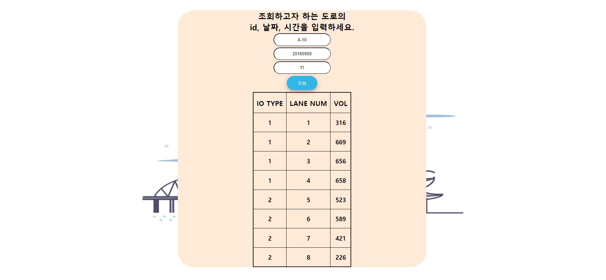
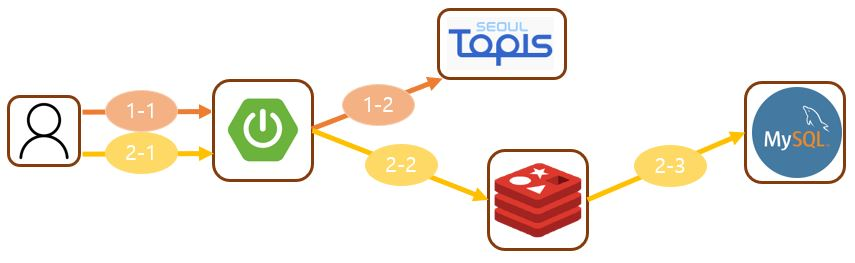

# 도로 정보 조회 기능 상세

api가 저장되는 형태 보여주기 (DB, 레디스)

api예외처리 어떻게 했는지 보여주기

어떻게 구현했는지 간단한 설명

## 1. 도로 정보 데이터 형태
이 프로젝트에서 사용하는 "서울시 공공 데이터" API는 두가지 이다.
### 1-1. 조회할 수 있는 도로 목록
```
<SpotInfo>
    <list_total_count>139</list_total_count>
    <RESULT>
        <CODE>INFO-000</CODE>
        <MESSAGE>정상 처리되었습니다</MESSAGE>
    </RESULT>
    <row>
        <spot_num>A-01</spot_num>
        <spot_nm>성산로(금화터널)</spot_nm>
    </row>
    <row>
        <spot_num>A-02</spot_num>
        <spot_nm>사직로(사직터널)</spot_nm>
    </row>
    ...
</SpotInfo>
```
도로 이름과 도로 ID 목록 데이터이다.
### 1-2. 도로 교통량
```
<VolInfo>
    <list_total_count>8</list_total_count>
    <RESULT>
        <CODE>INFO-000</CODE>
        <MESSAGE>정상 처리되었습니다</MESSAGE>
    </RESULT>
    <row>
        <spot_num>A-10</spot_num>
        <ymd>20220203</ymd>
        <hh>22</hh>
        <io_type>1</io_type>
        <lane_num>1</lane_num>
        <vol>49</vol>
    </row>
    <row>
        <spot_num>A-10</spot_num>
        <ymd>20220203</ymd>
        <hh>22</hh>
        <io_type>1</io_type>
        <lane_num>2</lane_num>
        <vol>224</vol>
    </row>
    ...
</VolInfo>
```
도로 ID, 날짜, 시간을 인자로 넘겨주면 도로 교통량 정보를 알 수 있다.
- spot_num : 도로 ID
- ymd : 날짜
- hh : 시간 (24시간)
- io_type : 도로 방향
- lane_num : 차선 번호
- vol : 교통량

## 2. 기능 화면
### 2-1. 조회할 수 있는 도로 목록

사용자가 조회할 수 있는 도로 목록이 출력된다.
### 2-2. 도로 교통량

조회를 원하는 도로 ID, 날짜, 시간을 입력하면 그에 해당하는 데이터가 촐력된다.

## 3. 기능 구조

## 4. 기능 설명
### 4-1. API에서 조회하기 (5년전 ~ 과거 데이터)
- 1-1 : 사용자가 [5년전 ~ 과거] 범위의 도로 데이터를 메인서버에 요청
- 1-2 : 메인 서버가 서울시 제공 API에 정보 요청하고 받은 데이터 사용자에게 반환
### 4-2. DB에서 조회하기 (현재 ~ 5년전 데이터)
- 2-1 : 사용자가 [현재 ~ 5년전] 범위의 도로 데이터를 메인서버에 요청
- 2-2 : 메인 서버가 레디스에 데이터 조회. 찾는 데이터가 있다면 반환.
- 2-3 : 레디스에 데이터가 없는 경우, 데이터를 MySQL에서 검색. MySQL에서 찾은 데이터는 레디스에 캐시(expire 적용)