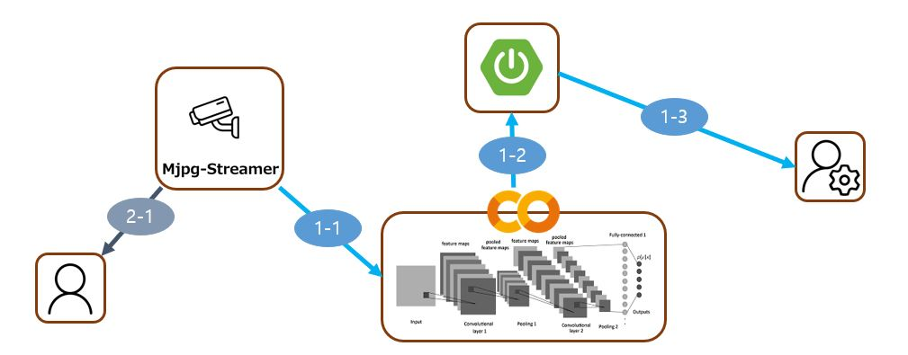

# 도로 상황 추론 & 알림 기능

## 1. 기능 구조

- CCTV의 영상은 Mjpg-Streamer를 사용하여 외부에 송출

## 2. 기능 설명
### 2-1. 도로 상황 판단 결과 조회하기
- 1-1 : CCTV 영상을 딥러닝의 입력값으로 전달
- 1-2 : 딥러닝이 CCTV 영상을 바탕으로 추론한 결과를 메인 서버에 전송
- 1-3 : 메인 서버는 사용자에 판단 결과를 전송
### 2-2. CCTV영상 조회하기
- 2-1 : CCTV 영상을 사용자가 조회할 수 있음

