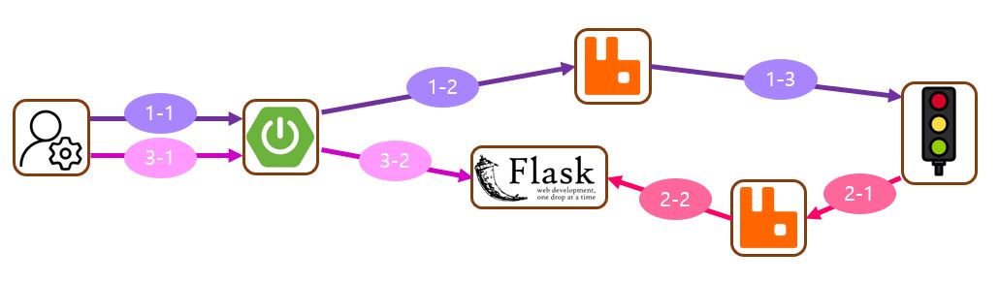

# 신호등 신호 변경 기능

## 1. 기능 구조

## 2. 기능 설명
### 2-1. 신호등 변경 요청
- 1-1 : 관리자가 신호등 변경 요청을 메인서버에 전송
- 1-2 : 메인 서버는 MQ에 신호 변경 요청 입력
- 1-3 : MQ를 듣고있던 신호등 프로세스는 신호 변경 로직 실행

### 2-2. 신호 상태 저장
- 2-1 : 신호등 프로세스에서 현재 신호등 상태(어떤 곳이 파란불인지, 몇초 남았는지)를 MQ에 전달
- 2-2 : MQ의 Consumer인 Flask 서버 프로세스가 해당 상태를 저장

### 2-3. 신호등 상태 요청
- 3-1 : 관리자가 신호등 상태 정보 조회 요청을 메인 서버에 전송
- 3-2 : 메인 서버는 Flask서버에 상태 정보를 요청하고 정보를 관리자에 반환

## 추가 설명
1. 신호등의 신호 변경 요청을 웹서버(Flask)가 받도록 했음
    - 2021 전국 교통사고 횟수 : 약 200,000회, 서울 신호등 갯수 : 약 50,000대
    - 신호등 변경 요청이 발생하는 경우는 비교적 드문 편
    - 따라서 Stateless 프로토콜을 사용하는 서버를 사용하는 것이 좋음
    - 신호 변경 요청은 반드시 전달되어야 하므로, TCP 프로토콜을 기반으로 하는 것이 좋음
    - Application Layer에서 Stateless 프로토콜인 HTTP 프로토콜을 사용하는 것이 좋다고 판단
    - 간단한 기능만을 사용하므로, Flask를 사용함