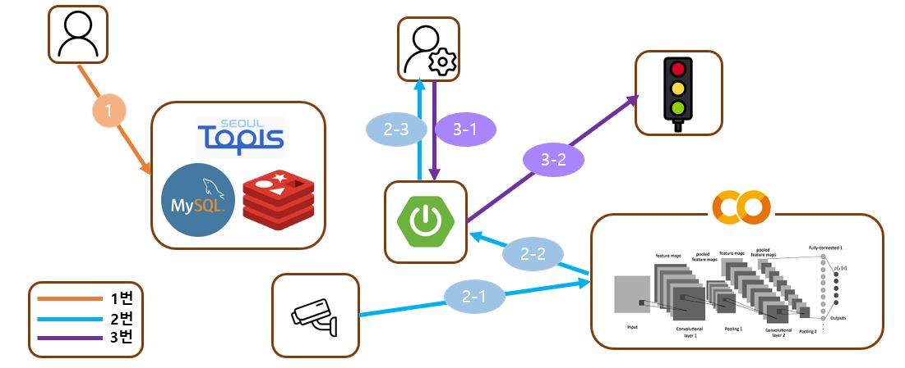

# 21년도 한이음 프로젝트

## 개발 기간
- 21.08 ~ 21.11 (한이음 종료)
- 프로젝트 추가 개선 중

## 주제 선정 이유
- 소방차, 구급차와 같은 긴급 차량의 신속한 현장 도착을 돕기 위함

## 문제 해결 방법
- 도로의 CCTV로 긴급상황 탐지 & 관리자에 알림
- 관리자가 신호등의 신호를 조절하여 긴급차량이 현장에 빠르게 도착할 수 있도록 도움

## 애플리케이션 구조

1. 메인 서버와 CCTV의 연결
   - Mjpg-Streamer로 CCTV 영상을 메인 서버에 전송
   - 사용자는 홈페이지에서 CCTV가 송출하는 영상을 조회할 수 있음 
2. CCTV와 딥러닝 모델의 연결
   - CCTV 영상을 딥러닝 모델의 입력값으로 입력 
3. 딥러닝 모델과 메인 서버의 연결
   - 도로 이미지(CCTV) 추론 결과를 메인 서버에 전송
4. 메인 서버와 신호등 서버의 연결
   - 현재 신호등의 작동 상황을 메인 서버에 전송
   - 메인 서버에서 신호 변경 요청 (관리자 권한 필요)
5. 공공 교통 API와 메인 서버와 연결
   - 공공교통 API에서 제공하는 도로 정보를 메인 서버에서 조회 가능
6. 메인 서버와 MySql 연결
   - 로그인 기능
   - 일부 도로 정보 조회
7. 일반 사용자
   - CCTV 영상 조회
   - 도로 정보 조회
8. 관리자
   - CCTV 추론 결과 조회
   - 신호 상태 조회
   - 신호등의 신호 변경

