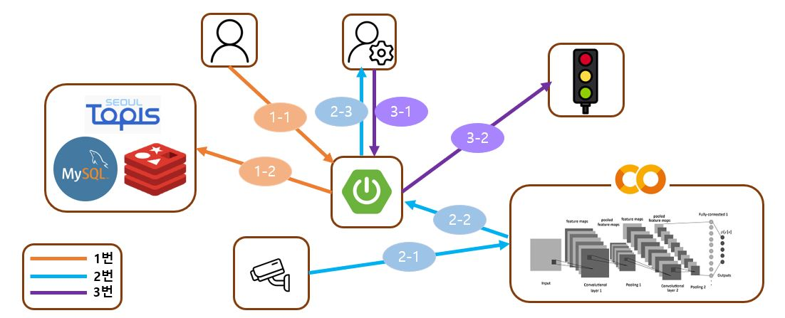

# 21년도 한이음 프로젝트 (스마트 신호등)

## 1. 주제 선정 이유
- 교통사고 발생 시, 긴급 차량의 신속한 현장 도착을 돕기 위함
- 교통 흐름을 빠르게 정상화 하고, 부상자를 빠르게 이송하도록 돕기 위함

## 2. 문제 해결 방법
- 도로의 CCTV로 긴급상황 탐지 & 관리자에 알림
- 관리자가 신호등의 신호를 조절하여 긴급차량이 현장에 빠르게 도착할 수 있도록 도움

## 3. 애플리케이션 구조

## 4. 애플리케이션 메인 기능

### 4-1. 도로 정보 조회 기능
- 1-1 : 사용자가 도로 교통량을 메인 서버에 요청
- 1-2 : 메인 서버는 공공 API혹은 DB에서 해당 정보를 조회하고 사용자에 반환

### 4-2. 도로 상황 추론 & 알림 기능
- 2-1 : 도로 CCTV에서 촬영하고 있는 영상을 딥러닝(CNN)의 입력값으로 전달
- 2-2 : 딥러닝이 추론한 도로 상황(평시, 사고)을 메인 서버에 전달
- 2-3 : 관리자가 메인 서버에서 이를 조회하거나, 알림을 받을 수 있음

### 4-3. 신호등 신호 변경 기능
- 3-1 : 관리자가 메인 서버에 신호등 변경 요청
- 3-2 : 메인 서버가 신호등에 신호 변경 요청 전달

## 5. 애플리케이션 메인 기능 상세
- 1 : [도로 정보 조회 기능](./README-details/README-detail-1.md)
- 2 : [도로 상황 추론 & 알림 기능](./README-details/README-detail-2.md)
- 3 : [신호등 신호 변경 기능](./README-details/README-detail-3.md)

## 6. 개발 기간
- 21.08 ~ 21.11 (한이음 종료)
- 프로젝트 추가 개선 중

## 7. 개발 인원
- 3명

## 8. 프로젝트에서의 역할
- 백엔드 전체 구현
- 클라이언트와 백엔드 통신을 위한 JS 코드 전체 구현